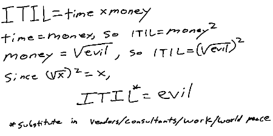

## DevSecOps Lausanne meetup - 13.06.2017
A journey to DevSecOps
---
Embracing DevOps

- Re-org 
- New management
- **Engineering tech leads empowered**

[Sponsor plug: I am hiring!]

---
How we do DevOps

- Knock walls down (literally) |
- Empower engineering leads |
- Always-on "Designated ops" in "solutions" team |
- Still in the early days of rolling out DevSecOps |

---
 Back to the future
* I've been told DevOps was like back in the 70's and 80's, but I am too young to remember :-)

---
# Hello DevOps!
* People first
  * You've been telling your teams to endorse [more] responsibilities.
  * You've been telling your developers to build & run
    * ... and be on-call.
  * You've been telling your Ops guys to get curious about the software they're running

--> Without the right people, you're doomed to fail.

---
# Goals of DevSecOps - bring security forward
* Intrinsic security while building (bake in, not bolt on)
* Compliance (i.e. audit trails, reduce human errors)

## anti-patterns
* Lean Startup approach:  MVP -> release -> user feedback (iterate)

* Using a traditional approach, how do you work with security teams? (no doc, no design)

## Challenges
As seen in pure DevOps, the pillars are:
  * Culture
  * People
  * Process

---
# DevOps and Security are no enemy
## Gaps between CorpSec and DevOps teams
* Separation of duties
  * i.e., iso27001
* Still under the impression that there should be few (and big) controlled changes
* Security still at the perimeter
  * CorpSec often lacks pure engineering skills - spend too much time in word doc and procedures
  * DevOps just find easy workarounds (Ever seen the light at the end of a [ssh] tunnel?)
* Code instead of W--- docs

---
# DevOps and Security are no enemy (cont'd)
* Frequent changes and software updates is good for security
  * How long do you think it takes to prepare an attack?
  * Most exploits are against legacy code

---
# Secret management
* Hashicorp vault
* Keywhiz

---
# Hush your ego, leverage your teammates
* Ask your Ops guys
  * [Good] network guys usually have some security skills under the belt
  * [Good] systems engineers usually know how to secure an O/S or a middleware component

* Code reviews
  * Not only between Devs
  * Can also happen with Ops or Secs guys

---
# Automate security into your CI/CD

* i.e. Static analysis (i.e. sonarqube + OWASP plugin)
* CoreOS clair for static image analysis (avoid poisoned image attacks)
* Use docker-bench-security to spot `[WARN]` or higher
* NetFlow your firewalls and see if your zones are still as trusted as it should

---
# Experiment
* Capture the Flag
* Read/Blue teams
  * (Not talking about NERFs battles here)
* Bounty programs (i.e. hackerone.com, github security)
* Pen testing

---
# Automate
## Infra as code
Puppet

## Scans
* Trigger a scan as part of your integration workflow

---
# Measure
---
# What can you do?
* Adopt a software security engineer / infra security engineer
* Have someone volunteer to wear that hat

## Secure your code repo
* Wealth of info not to fall in the wrong hands

## Adapt your monitoring
* Dynamic monitoring for containers and cloud workloads
* Constant redployment

---
# References
- Veracode : The Developer's Guide to the DevSecOps galaxy
- DevOps and Security: From the Trenches to Command Centers: https://blog.xebialabs.com/2017/05/04/devops-security-trenches-command-centers
- How Etsy makes Devops work: http://www.networkworld.com/article/2886672/software/how-etsy-makes-devops-work.html
- DevSecOps : http://www.oreilly.com/webops-perf/free/files/devopssec.pdf
- The treacherous 12: https://downloads.cloudsecurityalliance.org/assets/research/top-threats/Treacherous-12_Cloud-Computing_Top-Threats.pdf
